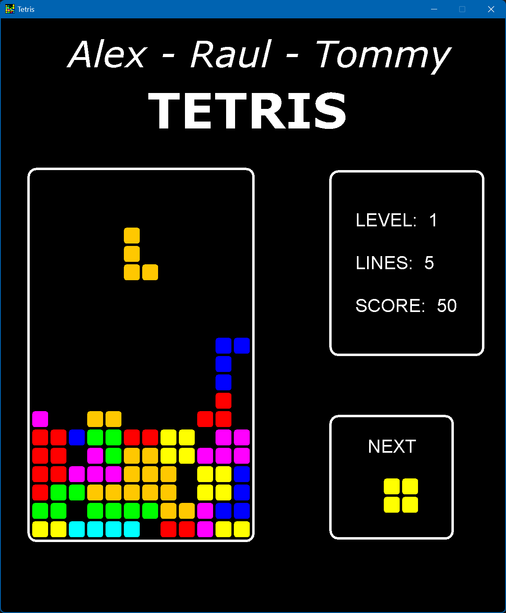
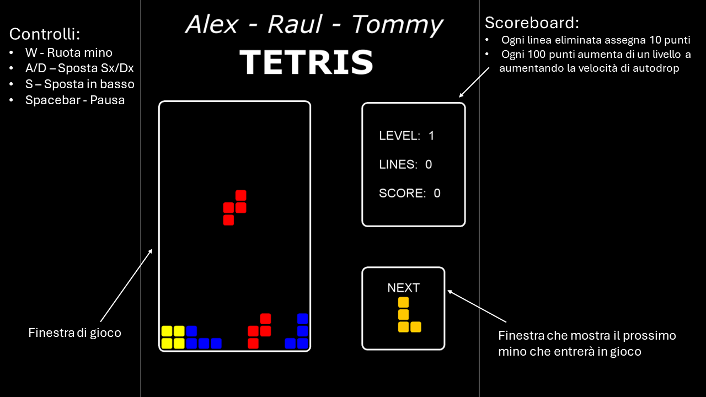

# Revisited TETRIS

<a href="https://www.codefactor.io/repository/github/raulchiasso/pss-chiasserinifocaapostol-tetris"></a>


<br />
<div align="center">
  <a href="https://github.com/RaulChiasso/PSS-ChiasseriniFocaApostol-Tetris">
    
  </a>
</div>

<br />
<div align="left">
  Revisited TETRIS is a Java project that provides a simple implementation of the classic TETRIS game.
  This is a project for the SDD - Software Design and Development course of the University of Bologna degree (PSS - Tecnologie dei sistemi informatici - Cesena).
  Contains an our own implementation of the classic TETRIS game with the original blocks an colors that can be played with WASD.
</div>

## Features

Minimal and optional features that we have implemented:

- [X] Behaviour of the game follows the original game TETRIS 
- [X] ScoreBoard
- [X] Pause and GameOver
- [X] Sound Effects
- [X] Menù before starting the game
- [X] Tutorial

## Commands
- **Rotate**: `W`
- **Move (Left - Right)**: `A` `D`
- **Drop down**: `S`
- **Pause**: `Spacebar`

<br />
<div align="center">
  
  </a>
</div>

## Build and Execute

For build Revisited Tetris you can use Gradle, first you have to clone the repo:

```bash
git clone https://github.com/RaulChiasso/PSS-ChiasseriniFocaApostol-Tetris.git
```

You can then build it and run it on linux or mac-os with:

```bash
./gradlew build
./gradlew run
```

If you are on Windows you can use:

```bash
gradlew.bat build
gradlew.bat run
```

## Authors

- Raul Chiasserini <raul.chiasserini@studio.unibo.it><br />

- Tommaso Foca <tommaso.foca@studio.unibo.it><br />

- Alexandru Apostol <alexandru.apostol@studio.unibo.it><br />
