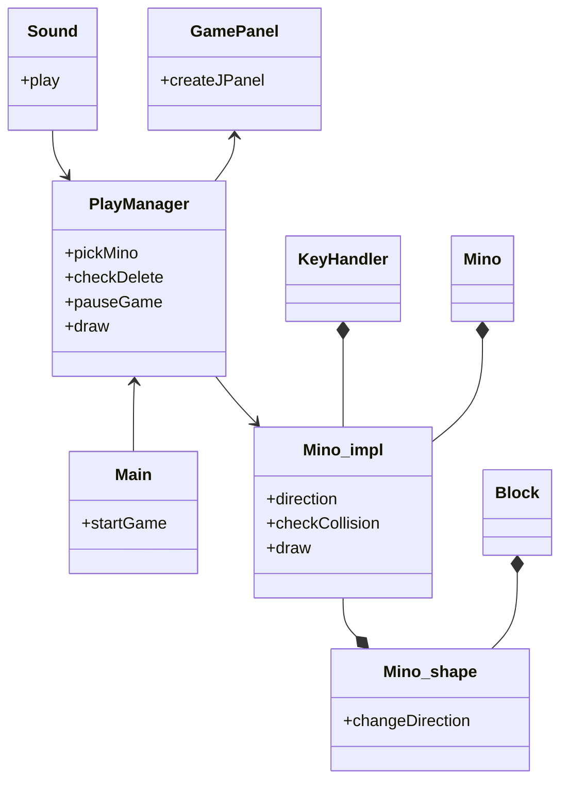
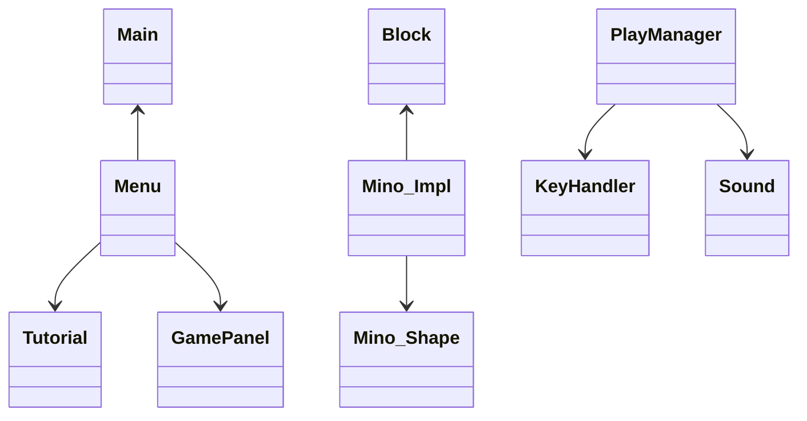
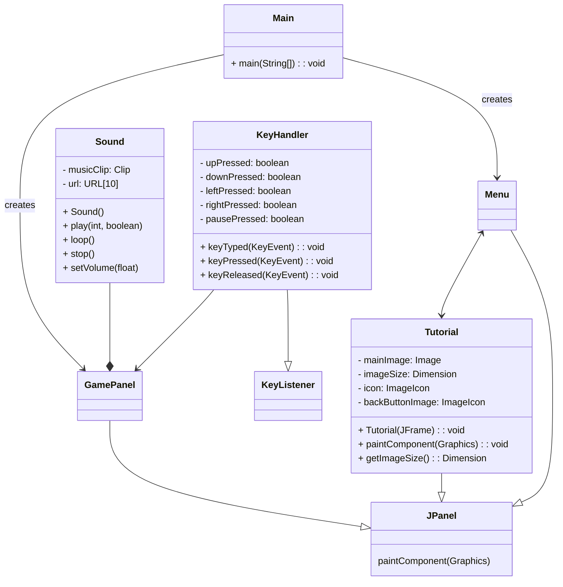
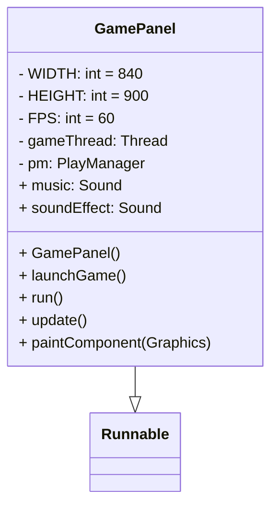
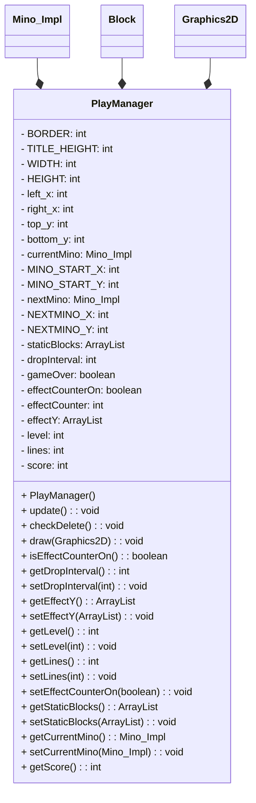
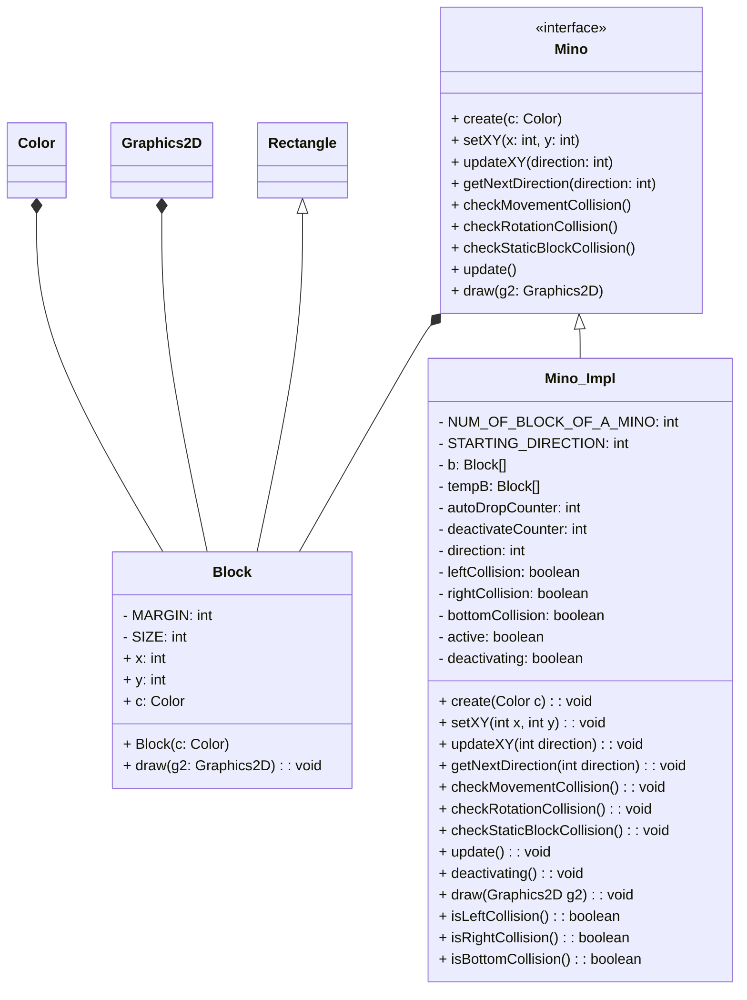
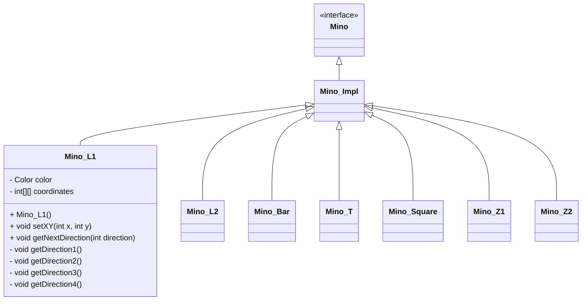
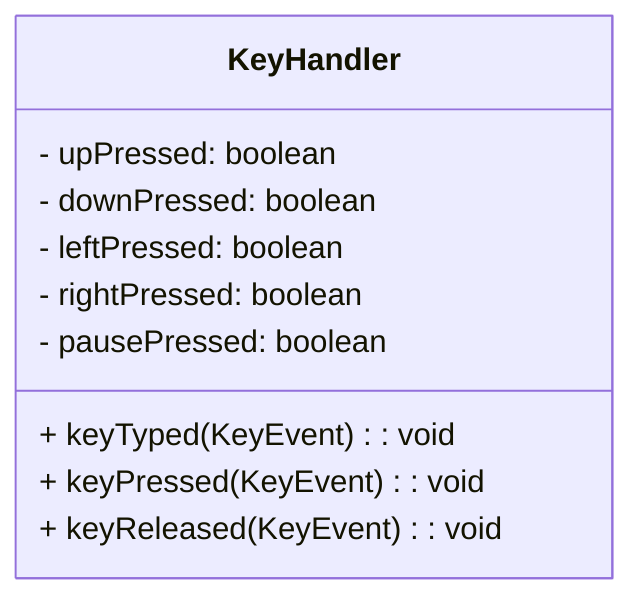
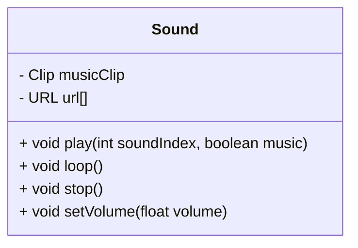
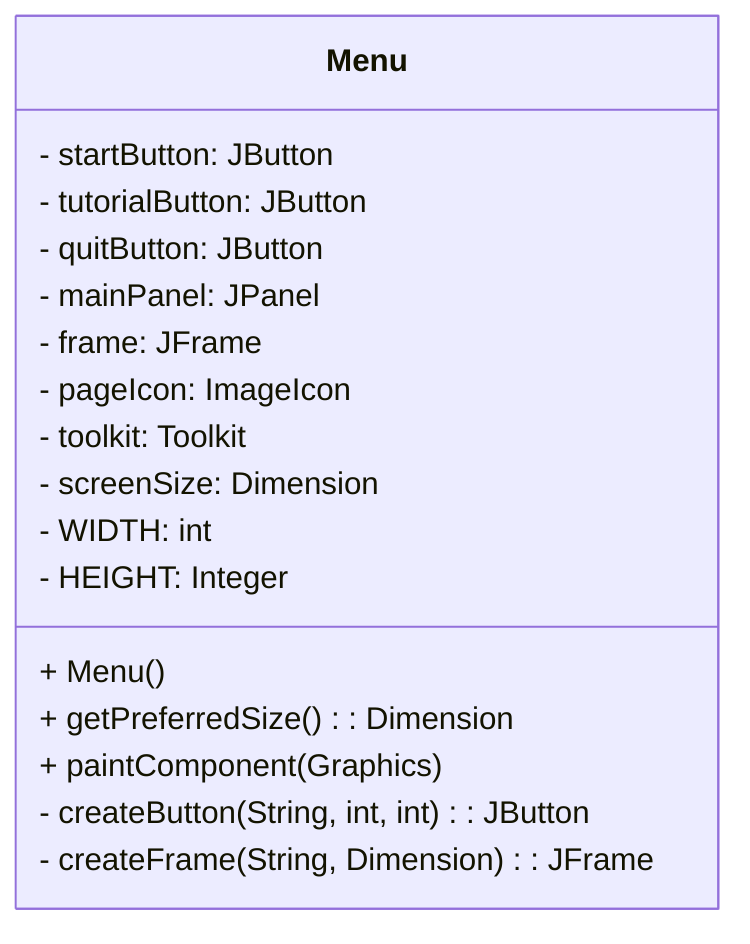

# Relazione per Progettazione e Sviluppo del Software

# Analisi

## Requisiti

Il gruppo si è posto l'obiettivo di sviluppare il gioco Tetris.
"Revisited TETRIS" è un progetto Java che fornisce una semplice implementazione del classico gioco Tetris.
Il gioco vede come obiettivo principale quello di manipolare i blocchi geometrici chiamati tetramini mentre cadono nel campo di gioco in modo da creare linee orizzontali complete e senza spazi. Il gioco comprende un sistema di calcolo di punti e di avanzamento di livello. Una volta avanzati di livello, aumenta la velocità di discesa dei tetramini e, di conseguenza, la difficoltà del gioco.
Questo è un progetto per il corso PSS - Progettazione e Sviluppo del Software del corso di laurea dell'Università di Bologna (Tecnologie dei Sistemi Informatici - Cesena). 
Contiene la nostra implementazione del gioco Tetris classico con i blocchi e i colori originali. I blocchi vengono controllati con i tasti WASD e il progetto include effetti sonori. 
Il repository contiene tutto il necessario per compilare ed avviare il gioco.

### Requisiti funzionali

- [X] <b>Creazione dei blocchi</b>:

- [X] <b>Gestione delle rotazioni</b>: 

- [X] <b>Gestione delle collisioni</b>: 

- [X] <b>Gestione di suoni e musica</b>: 

- [X] <b>Pausa e GameOver</b>: 

### Requisiti non funzionali

- [X] <b>Menu principale</b>: 

- [X] <b>Tutorial</b>:

- [ ] <b>Restart del gioco</b>:

- [ ] <b>Miglioramento grafica</b>:


## Analisi e modello del dominio

Il progetto si compone di diverse classi e le entità principali sono rappresentati dai tetramini. I tetramini vengono scelti in maniera casuale dal programma e cadono dall'alto ad una velocità specifica, la quale aumenta con l'aumentare dei livelli. Il gioco termina quando i tetramini raggiungono la cima del campo di gioco. Revisited Tetris non prevede una vittoria del giocatore, ma lo scopo si basa sull'accumulare quanti più punti possibile.

L'avanzamento dei livelli avviene collezionando punti, i quali vengono assegnati ogni volta che si completa una riga orizzontale incastrando i tetramini in modo da non lasciare spazi tra di essi. 

L'interfaccia è composta dal campo di gioco, rappresentato da un rettangolo sul lato sinistro della schermata, dalla tabella dello score sulla destra e, posto sotto di essa, il riquadro che indica il prossimo tetramino in gioco.

È prevista l'implementazione di un Menu principale, il quale si aprirà all'avvio dell'eseguibile e mostrerà tre tasti di navigazione: Start, Tutorial e Quit.



# Design

## Architettura

L'architettura di Revisited Tetris si basa su 3 classi fondamentali che contengono le 3 parti principali del progetto:
 - Menu: Che è la classe creata dal main all'avvio dell'applicazione e si occupa tramite classi di supporto come Tutorial e GamePanel di costruire
 e visualizzare il JFrame e il JPanel al suo interno.
 - Mino_Impl: Racchiude la logica base di tutti i mino che poi viene esteso per creare tutte le varie forme dei mino presenti nel gioco.
 - PlayManager: È il core effettivo del gioco perchè al suo interno sono implementate le regole di cancellazzione blocchi, punteggio e refresh del GamePanel.



## Design dettagliato

## Raul Chiasserini

La mia parte all'interno del progetto provedeva di implementare il Main dell'applicazione, il GamePanel che serve a disegnare il JPanel di gioco con tutti gli elementi grafici al suo interno e il PlayManager che è la classe core del gioco perchè contiene la gestione dei Mino, i comandi per poter giocare e le funzione che regolano il gioco controllando eliminazione dei blocchi, punteggio e refresh degli elementi grafici a schermo.

### Struttura di base:



### Main

Questa è la struttura del progetto come si presenta ora, in un primo momento ho sviluppato il Main come classe che si occupava di creare tramite l'utilizzo di Swing un JFrame con all'interno un JPanel settandone le caratteristiche princiaple come dimensione della finestra ecc... 
In questo modo all'avvio del programma si sarebbe avviato direttamente il gioco perchè ci eravamo posti lo sviluppo del Menù come requisito opzionale che è stato poi sviluppato dal mio compagno Tommaso.

**Problema**

Il Problema è stato innanzitutto la scelta di qualche libreria grafica utilizzare.

**Soluzione**

La nostra scelta è ricaduta sull'utilizzo di Swing perchè ha degli elementi grafici molto utili per il tipo di progetto che volevamo sviluppare.
Ho quindi sviluppato il Main come classe che si occupava di creare un JFrame con all'interno un JPanel settandone le caratteristiche princiaple come dimensione della finestra ecc... 
In questo modo all'avvio del programma si sarebbe avviato direttamente il gioco perchè ci eravamo posti lo sviluppo del Menù come requisito opzionale che è stato poi sviluppato dal mio compagno Tommaso.

### GamePanel


    
**Problema**

Come gestiore il JPanel principale, ossia quello che contiene la schermata di gioco. 

**Soluzione**

Ho creato GamePanel che serve ad impostare le variabili base del pannello di gioco come le dimensioni e lo sfondo aggiungendo, tramite composizione, elementi che poi serviranno al gioco come il Suono dalla classe Sound e il collegamento alla tastiera tramite la classe KeyHandler.
Contiene anche la parte di refresh rate (60 FPS) per aggiornare gli elementi grafici che si sono mossi, in particolare l'autodrop del Mino
Infine demanda a PlayManager la gestione del disegno delle parti grafiche di contorno e tramite l'override del metodo run lancia il gioco.

### PlayManager



**Problema**

Lo sviluppo di quelle che sono le regole del gioco, quindi quando cancellare una riga piena, aggiunta punti ecc...

**Soluzione**

Playmanager contiene i metodi per la gestione del gioco come:
Il metodo update che controlla tutte le possibili opzioni di aggiornamento dal gameover al semplice autodrop di un mino.
Il metodo checkDelete che controlla se c'è un'intera riga di blocchi statici (ossia formati da pezzi "vecchi") e in caso la elimina con rispettivi effetti e cambiamento del punteggio.
La funzione pickMino che serve a restituire un mino casuale che sarà il successivo ad entrare in gioco.
Tutto questo serve a strutturare le regole del nostro gioco che sono poi le regole del classico tetris.

## Alexandru Apostol

Il mio contributo al progetto "Tetris" include la progettazione e implementazione delle classi per gestire i vari tipi di "mino", 
definendo un'interfaccia generica per uniformare il comportamento dei "mino" e garantire una gestione modulare. 
Ho sviluppato funzioni per gestire collisioni e aggiornamenti dello stato dei "mino", assicurando un movimento fluido e intuitivo durante il gameplay. 
Inoltre, ho creato metodi per il disegno accurato dei "mino" sullo schermo, contribuendo così a una rappresentazione visiva coinvolgente per i giocatori.

### Creazione dei blocchi

Rappresentazione UML della fase di creazione dei blocchi:



**Problema**

Il problema principale affrontato è stato la necessità di creare i blocchi e diversi tipi di "mino",
ognuno con caratteristiche e rotazioni specifiche. 

**Soluzione**

La soluzione adottata è stata l'implementazione di un'interfaccia che definisse le caratteristiche comuni a tutti i "mino",
mentre le implementazioni specifiche per ciascun tipo di "mino" sarebbero state gestite da classi separate.


### Implementazioni caratteristiche generali dei "mino"

Rappresentazione UML della fase di implementazione delle caratteristiche dei "mino"



**Problema**

Il problema è quello di implementare tutte le caratteristiche generiche su ogni tipologia di "mino" gestendo inoltre anche le rotazioni specifiche in base alle figure generate

**Soluzione**

L'interfaccia Mino ha definito le funzionalità di base che tutti i "mino" devono possedere,
come la creazione, la gestione delle coordinate, il controllo delle collisioni e l'aggiornamento dello stato. 
Questo ha permesso una gestione uniforme e coesa di tutte le istanze di "mino" nel gioco.

La classe Mino_Impl è stata creata per implementare l'interfaccia Mino e fornire le caratteristiche comuni a tutti i "mino". 
Questa classe ha gestito le funzionalità generali, come il movimento laterale e verticale, le rotazioni e il controllo delle collisioni, 
garantendo coerenza e facilitando il riutilizzo del codice.

Per ogni tipo specifico di "mino", come ad esempio il Mino_Bar, 
è stata creata una classe separata che estende Mino_Impl e implementa le rotazioni specifiche per quel tipo di "mino". 
Questo approccio ha permesso una gestione modulare e scalabile dei diversi tipi di "mino", 
consentendo l'aggiunta di nuovi tipi con facilità e mantenendo un alto grado di coerenza nel codice.

## Tommaso Foca

In questo progetto il mio ruolo è stato quello di gestire gli input da tastiera per controllare il gioco, implementare suoni e musica all'interno del gioco e creare il pannello del menù principale e la pagina contenente il tutorial del gioco. Ho implementato la classe Sound, utilizzata per sfruttare i suoni in formato .wav e per impostare il livello del volume. Per la creazione dei suoni è stato utilizzato BeepBox online (https://www.beepbox.co). Inoltre ho creato la classe Menu la quale, modificando il main, verrà aperta all'avvio dell'eseguibile per mostrare il menù di gioco con le relative scelte utente.

### Implementazione KeyHandler

**KeyHandler**



**Problema**

Per poter giocare è necessaria una classe che sia in grado di rilevare gli input da tastiera dell'utente e identificare i tasti specifici necessari al funzionamento del gioco.

**Soluzione**

Per poter far fronte al problema ho implementato la classe KeyHandler, che si occupa per la precisione di riconoscere quando un utente preme uno dei tasti mappati per poter gestire in seguito le funzioni specifiche ad essi assegnate.

### Implementazione suoni

**Sound**



**Problema**

Il progetto richiede di implementare una classe che sia in grado di importare un file audio esterno e di utilizzare delle librerie adatte ad elaborare e riprodurre il suono al momento opportuno. Inoltre è necessario un metodo che gestisca in qualche modo il volume dei suoni e della musica separatamente, poiché potrebbero effettuarsi overlapping o altri effetti indesiderati, ad esempio la musica potrebbe rendere gli effetti sonori quasi inudibili.

**Soluzione**

La classe Sound crea una lista di suoni utilizzabili, importando i file .wav dalla cartella designata. La classe distingue i suoni dalla musica tramite una variabile booleana, in modo da poter impostare la musica in loop, minimizzando la quantità di codice utilizzata. Inoltre è stato implementato un metodo per gestire singolarmente il volume di suoni e musica, il quale utilizza dei valori floating-point. In definitiva, Sound.java fornisce alcuni metodi di controllo dei file audio del progetto, i quali verranno richiamati dalle classi che gestiscono l'avvio e lo sviluppo del gioco nei momenti opportuni.

### Creazione della finestra di Menu

**Menu**



**Problema**

All'avvio dell'eseguibile del programma, il gioco parte senza che l'utente possa avere il tempo di ambientarsi o prepararsi a giocare. L'applicazione ha quindi bisogno di una finestra di menu iniziale, in cui l'utente può prepararsi all'avvio del gioco e può interfacciarsi con una schermata di tutorial che spieghi l'utilizzo corretto dei tasti e illustri la schermata di gioco nelle sue differenti sezioni. L'obbiettivo è anche quello di rendere la navigazione del menu semplice, intuitiva ed efficace.

**Soluzione**

La classe Menu è stata implementata con lo scopo di soddisfare queste specifiche. Viene creata un'istanza di Menu direttamente all'avvio dell'applicazione, nella Main class. La classe Menu crea un nuovo JFrame che si adatta alle dimensioni correnti dello schermo, dentro il quale vengono visualizzati tre pulsanti di navigazione: Start, Tutorial e Quit. Per la creazione ci si è serviti di una classe Tutorial in cui viene gestita la visualizzazione dell'interfaccia di guida del gioco e il pulsante di ritorno al menu.

**Pulsanti**

- Start: 
Pulsante per far partire il gioco; una volta premuto crea una nuova finestra e l'istanza di GamePanel, aggiungendo         quest'ultima alla finestra. Dopodiché utilizza gamePanel per avviare il gioco.

- Tutorial: 
Questo pulsante crea un nuovo JFrame al quale viene assegnata l'istanza della classe Tutorial. Questa classe gestisce la visualizzazione della guida di gioco e fornisce un pulsante che permette di tornare al menu principale.

- Quit:
Il pulsante Quit ha come unico scopo quello di uscire dal gioco, chiudendo la finestra del Menu.

# Sviluppo

## Testing automatizzato

Per testare il corretto funzionamento delle parti fondamentali del progetto 
abbiamo implementato dei test automatizzati tramite la libreria JUnitTest
dove controllavamo tutti i vari comportamenti dei mino.

- **Mino_Impl_Test**: Verifica le collisioni che un mino può fare con le "pareti"
sia durante un movimento orizzontale che durante una rotazione.
- **Mino_L2_Test**: Verifica la corretta posizione del mino nella posizione iniziale e dopo ognuna delle 4 rotazioni possibili.

## Note di sviluppo

### Raul Chiasserini

#### Utilizzo della libreria Swing

**Dove**: classi Menu, GamePanel, `package it.unibo.tetris.GamePanel`, `package it.unibo.tetris.GamePanel`.

**Permalink**: https://github.com/RaulChiasso/PSS-ChiasseriniFocaApostol-Tetris/blob/master/src/main/java/it/unibo/tetris/GamePanel.java

**Snippet**

```java
    /*
     * Creating JPanel setting his background and layout.
     */
    this.mainPanel = new JPanel();
    mainPanel.setBackground(Color.black);
    mainPanel.setLayout(new GridLayout(3, 1, 10, 30));

    /*
     * Creating the JFrame.
     */
    this.frame = createFrame("Tetris", screenSize);
    frame.add(mainPanel);
```

**Descrizione**: Ho utilizzato la libreria Swing per gestire le parti grafiche del progetto perchè data la natura del gioco abbiamo trovato
molto utili gli oggetti che Swing mette a disposizione come JFrame e JPanel che ho sfruttato per disegnare la finestra di gioco e gestire i vari JPanel che vengono visualizzati al suo interno cme GamePanel e Tutorial.

#### Utilizzo della libreria JUnitTest

**Dove**: classi Mino_Impl_Test, Mino_L2_Test.

**Permalink**: https://github.com/RaulChiasso/PSS-ChiasseriniFocaApostol-Tetris/blob/master/src/test/java/Mino_Impl_Test.java

**Snippet**

```java
    /**
     * Test rotations when {@link Mino} don't collide.
     */
    @Test
    public void testRotationCollisionNoCollision() {
        /*
         * Move the mino to the left so that it collides with the left boundary.
         */
        mino.tempB[0].x = PlayManager.left_x +  2*Block.SIZE;
        mino.tempB[1].x = PlayManager.left_x +  2*Block.SIZE;
        mino.tempB[2].x = PlayManager.left_x +  2*Block.SIZE;
        mino.tempB[3].x = PlayManager.left_x +  2*Block.SIZE;

        /*
         * Perform rotation collision check.
         */
        mino.checkRotationCollision();

        /*
         * Verify that left collision is detected correctly.
         */
        assertFalse(mino.isLeftCollision());
    }
```

**Descrizione**: La libreria JUnit ci è stat findamentale per testare in modo automatizzato alcune delle funzionalità
principali del progetto, in particolare, il comportamento dei mino in rotazione nella classe Mino_L2_Test e controllare le collisioni in 
Mino_Impl_Test.
Tramite una serie di Assertions riusciamo a controllare che ogni mino rispetti il comportamento previsto.
Abbiamo sviluppato test per ogni singolo mino (non solo Mino_L2) ma abbiamo lasciato solo una classe di test 
per non appesantire troppo il progetto poichè i test sugli altri mino avevano la medesima struttura. 

### Alexandru Apostol

#### Utilizzo della libreria AWT

**Dove**: classi Mino_Impl, Mino, Block, PlayManager (font),  `package it.unibo.tetris.mino`, `package it.unibo.tetris.mino.api`, `package it.unibo.tetris`

**Permalink**: https://github.com/RaulChiasso/PSS-ChiasseriniFocaApostol-Tetris/blob/master/src/main/java/it/unibo/tetris/mino/Mino_Impl.java

**Snippet**

```@Override
    public void draw(Graphics2D g2) {
        g2.setColor(b[0].c);
        g2.fillRoundRect(b[0].x + Block.MARGIN,
                b[0].y + PlayManager.TITLE_HEIGHT + Block.MARGIN,
                Block.SIZE - (Block.MARGIN * 2),
                Block.SIZE - (Block.MARGIN * 2), 8, 8);
        g2.fillRoundRect(b[1].x + Block.MARGIN,
                b[1].y + PlayManager.TITLE_HEIGHT + Block.MARGIN,
                Block.SIZE - (Block.MARGIN * 2),
                Block.SIZE - (Block.MARGIN * 2), 8, 8);
        g2.fillRoundRect(b[2].x + Block.MARGIN,
                b[2].y + PlayManager.TITLE_HEIGHT + Block.MARGIN,
                Block.SIZE - (Block.MARGIN * 2),
                Block.SIZE - (Block.MARGIN * 2), 8, 8);
        g2.fillRoundRect(b[3].x + Block.MARGIN,
                b[3].y + PlayManager.TITLE_HEIGHT + Block.MARGIN,
                Block.SIZE - (Block.MARGIN * 2),
                Block.SIZE - (Block.MARGIN * 2), 8, 8);
    }
```

**Descrizione**: Ho utilizzato java.awt.Color:

Per definire il colore dei blocchi del "Mino".
Inoltre viene passato come parametro al costruttore della classe "Block" nella funzione "create".

java.awt.Graphics2D:

Viene utilizzato per disegnare i blocchi del "Mino" sul pannello di gioco.
La funzione "draw" prende un oggetto "Graphics2D" come parametro e utilizza i metodi "setColor" e "fillRoundRect" per disegnare i blocchi con il colore specificato 
e una forma arrotondata.

java.awt.Font:

La libreria java.awt.Font è stata utilizzata nella classe "PlayManager" dal mio compagno, Raul Chiasserini, per definire e gestire i caratteri tipografici (font), utilizzati per disegnare testo nelle applicazioni grafiche. 

### Tommaso Foca

### Utilizzo della libreria javax.sound

**Dove**: Classe Sound, `package it.unibo.tetris`

**Permalink**: https://github.com/RaulChiasso/PSS-ChiasseriniFocaApostol-Tetris/blob/master/src/main/java/it/unibo/tetris/Sound.java


**Snippet**

```java
 public Sound() {
        sounds[0] = getClass().getResource("/sounds/Tetris.wav");
        sounds[1] = getClass().getResource("/sounds/delete line.wav");
        sounds[2] = getClass().getResource("/sounds/gameover.wav");
        sounds[3] = getClass().getResource("/sounds/rotation.wav");
        sounds[4] = getClass().getResource("/sounds/touch floor.wav");
    }

public void play(int soundIndex, boolean music) {
        try {
            AudioInputStream ais = AudioSystem.getAudioInputStream(sounds[soundIndex]);
            Clip clip = AudioSystem.getClip();

            if (music) {
                musicClip = clip;
            }

            clip.open(ais);

            /*
            * Behaviour of the class when the sound finishes playing (in order to free some memory).
            */
            clip.addLineListener(new LineListener() {
                @Override
                public void update(LineEvent event){
                    if (event.getType() == LineEvent.Type.STOP) {
                        clip.close();
                    }
                }
            });
            ais.close();
            clip.start();
        } catch (Exception e) {
            System.out.println("An error occurred:");
            e.printStackTrace();
        }
    }

```

**Descrizione**: Ho utilizzato la libreria javax.sound per gestire l'audio all'interno del gioco Tetris. Questa libreria fornisce funzionalità avanzate per la gestione e il controllo dell'audio, consentendomi di integrare gli effetti sonori e la musica in modo efficace. Nel costruttore della classe, l'array URL viene inizializzato con i percorsi delle tracce audio, ottenuti tramite il metodo getResource() della classe "Class" che restituisce un oggetto URL che punta alla risorsa specificata.
Il metodo play utilizza l'indice fornito per accedere all'array di URL e ottenere il percorso del file audio corrispondente in modo da poter ottenere l'AudioInputStream della risorsa audio specificata.
Viene poi creata una Clip, ovvero un oggetto che può essere utilizzato per manipolare un suono e aggiunto un LineListener per monitorare gli eventi di riproduzione della Clip. Quando la riproduzione termina, essa viene chiusa.
La musica viene gestita separatamente dai suoni assegnando la Clip specifica ad una variabile musicClip, in modo da poter implementare il metodo loop() in sicurezza.
Lo stream audio viene chiuso in quanto non è più necessario dopo aver aperto la Clip, in seguito viene avviata la riproduzione del suono.
Si utilizzano anche i metodi stop() e setVolume() per, rispettivamente, fermare la riproduzione della musica e regolarne il volume.


### Utilizzo della libreria Awt.event  

**Dove**: Classe KeyHandler, classe Tutorial, classe Menu, `package it.unibo.tetris`

**Permalink**: https://github.com/RaulChiasso/PSS-ChiasseriniFocaApostol-Tetris/blob/master/src/main/java/it/unibo/tetris/KeyHandler.java


**Snippet**

```java
 @Override
    public void keyPressed(KeyEvent e) {
        int code = e.getKeyCode();

        /*
         * Check waht key is being pressed.
         */
        if (code == KeyEvent.VK_W) {
            upPressed = true;
        }
        if (code == KeyEvent.VK_A) {
            leftPressed = true;
        }
        if (code == KeyEvent.VK_S) {
            downPressed = true;
        }
        if (code == KeyEvent.VK_D) {
            rightPressed = true;
        }

        /*
         * Pause if spacebar is pressed. 
         */
        if(code == KeyEvent.VK_SPACE) {
            if (pausePressed) {
                pausePressed = false;
                GamePanel.music.play(0, true);
                GamePanel.music.loop();
                GamePanel.music.setVolume(-15.0f);
            } else {
                pausePressed = true;
                GamePanel.music.stop();
            }
        }

    }
```

**Descrizione**: La libreria viene utilizzata per la gestione degli eventi. Nella classe KeyHandler viene utilizzata per gestire gli eventi della tastiera. La classe implementa l'interfaccia KeyListener per rispondere agli eventi generati qunado un tasto viene premuto. È stata creata una variabile booleana per ogni tasto utilizato all'interno del gioco. La classe resta in ascolto dei tasti premuti sulla tastiera e, per ogni tasto premuto, ne confronta il codice e aggiorna di conseguenza le variabili booleane. In particolare, i tasti W, A, S, D vengono utilizzati per il movimento del mino, mentre il tasto SPACE viene utilizzato per gestire la pausa del gioco.

# Commenti finali

## Autovalutazione e lavori futuri

### Raul Chiasserini


Personalmente ho trovato lo sviluppo di questo progetto molto stimolante sia dal punto di vista del codice sia di tutti i sistemi che agevolano la programmazione, soprattutto in team.
Le difficoltà principali sono state la disparità di conoscenze sia del linguaggio che dei sistemi di controlli di versione che ci ha richesto tempo per poter essere appianata e riuscire a capire le varie possibilità che certi strumenti ci mettono a disposizione; abbiamo consumato molto tempo nella parte di scelta e studio del dominio applicativo che però che è stato risparmiato durante la fase di sviluppo perchè avevamo bene in testa come lavorare e siamo riusciti a scrivere il codice in modo abbastanza snello e funzionale al lavoro in team, distrubuendo le parti del progetto in modo equo e alternandoci facilmente nello sviluppo e nella manutenzione del codice.
Ho capito l'enorme importanza di strumenti di supporto e linee guida nello sviluppo come l'utilizzo di Git, la struttura dei commenti di Javadoc, l'uniformità visiva del codice che ti impone checkstyle e la praticità di build, test e run di Gradle.
Il punto critico è stato sicuramente la poca esperienza nell'utilizzo più funzionale possibile della riusabilità come concetto che Java esprime con forza e che ci ha portato, a mio parere, ad avere una pianificazione molto chiara in alcuni punti come la struttura dei Mino e molto più confusionaria in altri dove ci siamo ritrovati a creare classi complesse che svolgessero molti compiti anche "core" del progetto e non riuscendo a scorporare i concetti in una struttura più ampia ma più snella come è possibile fare in Java.


### Alexandru Apostol


Durante il progetto, mi sono messo alla prova, realizzando un'applicazione in un contesto totalmente nuovo, tramite una suddivisione equa dei ruoli e una collaborazione bilanciata, tra i miei compagni di progetto. 
Essendo il primo progetto con Git, è stato più impegnativo del previsto, specialmente nel decidere la distribuzione dei compiti, 
ma ha significato una grande opportunità per comprendere le funzionalità di Java e Gradle in un contesto più ampio. 
Abbiamo adottato diversi "Sprint" per un approccio flessibile e agile, rispettando le scadenze stabilite. 
Inoltre ho appreso l'importanza di scrivere un codice pulito e ben organizzato per facilitare il lavoro del team durante i controlli e lo sviluppo.
Sono soddisfatto del lavoro che abbiamo fatto, come team, e della nostra coordinazione, sicuramente nei prossimi lavori saremo ancora più precisi e dettagliati ma come inizio è stato veramente una bel progetto!


### Tommaso Foca

Questo progetto è stato un lavoro impegnativo quanto soddisfacente. Non avendo mai programmato in un linguaggio ad oggetti, la vera sfida è stato il cambio di approccio rispetto ad un linguaggio strutturato o procedurale. Tuttavia, una volta capita la base della programmazione ad oggetti, non è risultato troppo impegnativo utilizzare costrutti simili a quelli già appresi in altri corsi o riaddattarli a Java. Un'altra piccola difficolta l'ho riscontrata nella ricerca delle librerie adatte alle necessità del progetto. Lavorare in gruppo è stato stimolante, nonostante il lavoro fosse suddiviso e ognuno si sia occupato specialmente della propria parte, la comunicazione è stata essenziale al fine di sviluppare un progetto coerente e funzionante. Ciò che è certo è che alla fine del lavoro mi sento di aver migliorato le mie abilità come programmatore e di aver compiuto un ulteriore passo avanti verso il diventare un programmatore esperto.